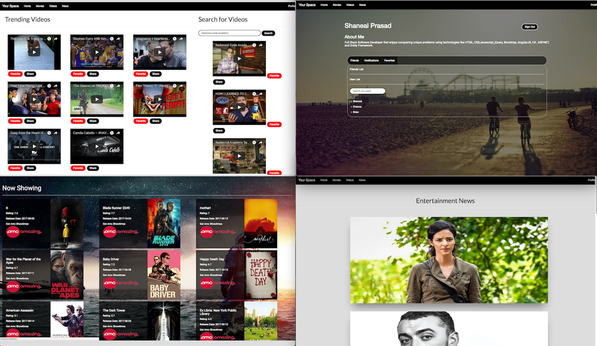

<h1>YourSpace</h1>

A social media site where you make your own entertainment. View whats going viral on our videos page, stay updated on occurrences in the entertainment world, and look at whats playing in the theaters! Connect with friends, share your favorite videos, and talk about whats trending!  

|  Technologies    |    
|-----------------:|    
| HTML             |    
| CSS              |    
| Bootstrap        |
| jQuery           |
| JavaScript       |
| AngularJS        |
| C#               |
| ASP.NET MVC      |
| Entity Framework |

| APIs        |
|-------------|
| Youtube     |
| TheMovieDb  |
| News API    |

<h2>Developers:</h2>
<h3>Brian Canlas - Front-end Developer</h3>
<h3>Shaneal Prasad - Full Stack Developer</h3>
<h3>Chance Hernandez - Full Stack Developer</h3>

<h3>Length: 2 week sprint</h3>

<h3>User Model Example:</h3>

| Parameters    | Value              | Description                 | Example                                      |
|---------------|--------------------|-----------------------------|----------------------------------------------|
| Username      | String             | User`s display name         | "b00oo00m3r4ng"                              |
| Firstname     | String             | User`s firstname            | "Shaneal"                                    |
| Lastname      | String             | User`s lastname             | "Prasad"                                     |
| Email         | String             | User`s email                | "shanealprasadsp@gmail.com"                  |
| Password      | String             | User`s Password             | "password"                                   |
| ProfilePic    | String             | User`s Profile Pic          |                                  |
| Online        | Bool               | User`s Online Status        | true                                         |
| Friends       | List<User>         | User`s Friends List         | [ User , User , User ]                       |
| Notifications | List<Notification> | User`s Notifications List   | [Notification , Notification , Notification] |
| Favorites     | List<Favorite>     | User`s Favorite Videos List | [Favorite , Favorite , Favorite]             |
| AboutMe       | String             | User`s self description     | "Full Stack Software Developer"              |

<h3>Challenges</h3>
    <ul>
        <li>Using what we learned from previous projects to provide clean code.</li>
        <li>Implementing new APIs</li>
        <li>Making everything work dynamically</li>
        <li>Using the youtube api and allowing our users to favorite videos</li>
        <li>Using the youtube api and allowing our users to share videos with each other</li>
        <li>Tons of .NET bugs that had to be fixed</li>
    </ul>